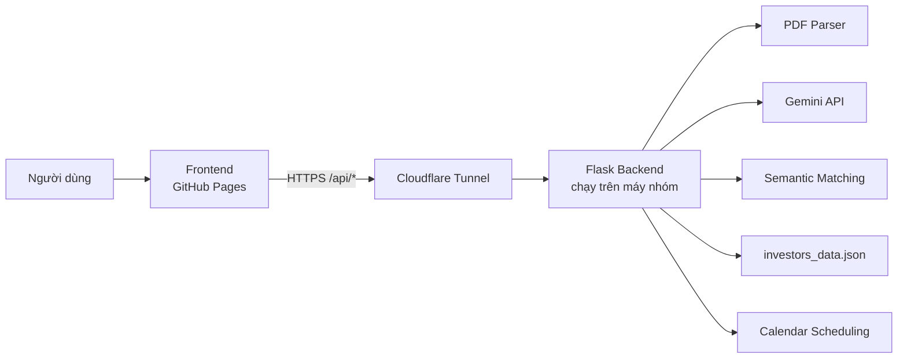

# Deal Connect — AI Investor Matching Platform

Deal Connect là nền tảng hỗ trợ startup phân tích pitch deck, trích xuất thông tin gọi vốn, tìm kiếm nhà đầu tư phù hợp và đề xuất thời gian gặp gỡ giữa startup với investor.

Dự án được xây dựng cho **VAIC 2026**, với kiến trúc tách riêng:

- **Frontend** được triển khai công khai bằng GitHub Pages.
- **Backend AI** chạy trên máy của nhóm.
- **Cloudflare Tunnel** tạo đường hầm HTTPS để frontend có thể gọi backend cục bộ trong quá trình demo.

> Repository này là **repository mã nguồn đầy đủ dùng để nộp và đánh giá dự án**.  
> Repository triển khai GitHub Pages được giữ riêng để phục vụ bản demo trực tuyến.

---

## 1. Liên kết dự án

| Thành phần | Đường dẫn | Mục đích |
|---|---|---|
| Frontend deployment repository | [tribach1234/default_vaic2026](https://github.com/tribach1234/default_vaic2026) | Repository dùng để triển khai giao diện bằng GitHub Pages |
| Full source-code repository | [tribach1234/default_vaic2026_src](https://github.com/tribach1234/default_vaic2026_src) | Repository nộp bài, chứa frontend, backend và các pitch deck kiểm thử |
| Live frontend | [Deal Connect GitHub Pages](https://tribach1234.github.io/default_vaic2026/) | Giao diện demo của hệ thống |

### Vì sao dự án sử dụng hai repository?

GitHub Pages chỉ phục vụ nội dung frontend tĩnh như HTML, JavaScript, CSS, hình ảnh và dữ liệu JSON. Backend của Deal Connect cần:

- Chạy Python và Flask.
- Xử lý file PDF do người dùng tải lên.
- Gọi mô hình Gemini thông qua API key.
- Thực hiện semantic matching.
- Quản lý các job phân tích bất đồng bộ.
- Tính toán và xác nhận các khung giờ gặp investor.

Vì vậy, backend không thể chạy trực tiếp trên GitHub Pages. Nhóm sử dụng:

1. Một repository gọn cho bản frontend được deploy.
2. Một repository `_src` chứa đầy đủ mã nguồn để ban tổ chức có thể kiểm tra toàn bộ giải pháp.

---

## 2. Kiến trúc hệ thống



### Luồng xử lý chính

1. Người dùng truy cập frontend trên GitHub Pages.
2. Người dùng tải lên một pitch deck dạng PDF.
3. Frontend gửi file đến URL Cloudflare Tunnel.
4. Cloudflare chuyển tiếp request đến backend Flask tại `127.0.0.1:5000`.
5. Backend:
   - đọc và phân tích PDF;
   - trích xuất thông tin startup;
   - lọc và xếp hạng nhà đầu tư;
   - tạo giải thích matching;
   - trả kết quả về frontend.
6. Startup có thể chọn investor, xem các khung giờ phù hợp và xác nhận một lịch gặp từ dữ liệu calendar demo.

---

## 3. Cấu trúc repository mã nguồn

```text
default_vaic2026_src/
├── deal-connect-cloudflare/
│   ├── github-pages/            # Frontend dùng cho GitHub Pages
│   │   ├── index.html
│   │   ├── config.js
│   │   ├── investors_data.json
│   │   └── assets/
│   │
│   └── local-backend/           # Backend Python chạy cục bộ
│       ├── app.py
│       ├── server.py
│       ├── config.py
│       ├── pipeline.py
│       ├── llm_service.py
│       ├── prompts.py
│       ├── gemini_client.py
│       ├── filter_and_semantic_matching.py
│       ├── calendar_api.py
│       ├── calendar_path.py
│       ├── calendar_service.py
│       ├── investors_data.json
│       ├── requirements.txt
│       ├── install_backend.bat
│       ├── start_backend.bat
│       └── cloudflare/
│
├── cloudbridge_sme_pitchdeck.pdf
├── PhysiLearn_Pitchdeck.pdf
├── SecureFlowAI_pitchdeck.pdf
├── AquaTraceImpact_pitchdeck.pdf
├── OrbitalInsightAnalytics_pitchdeck.pdf
└── README.md
```

Tên file hoặc cấu trúc thư mục thực tế có thể thay đổi nhẹ theo phiên bản commit, nhưng kiến trúc frontend/backend vẫn giữ nguyên.

---

## 4. Cloudflare Tunnel được sử dụng như thế nào?

Backend chạy trên máy cục bộ tại:

```text
http://127.0.0.1:5000
```

Trình duyệt đang mở frontend từ GitHub Pages không thể gọi trực tiếp địa chỉ `127.0.0.1` trên máy của nhóm đánh giá. Vì vậy, Deal Connect sử dụng **Cloudflare Quick Tunnel** để tạo một URL HTTPS công khai tạm thời:

```text
https://<random-name>.trycloudflare.com
```

Cloudflare nhận request từ frontend và chuyển tiếp request đó đến backend cục bộ:

```text
GitHub Pages
    → https://<random-name>.trycloudflare.com/api/...
    → http://127.0.0.1:5000/api/...
```

### Các endpoint chính

```text
GET  /api/health
POST /api/analyze
GET  /api/jobs/<job_id>
POST /api/calendar/schedule
POST /api/calendar/confirm
```

### Lưu ý về Quick Tunnel

Cloudflare Quick Tunnel phù hợp cho hackathon và demo, nhưng có các đặc điểm:

- URL tunnel có thể thay đổi sau mỗi lần khởi động lại.
- Backend chỉ hoạt động khi máy chạy backend vẫn bật.
- Cửa sổ chạy backend và cửa sổ chạy Cloudflare Tunnel phải được giữ mở.
- Nếu máy sleep, restart hoặc mất mạng, backend và tunnel phải được khởi động lại.
- Sau khi URL tunnel thay đổi, cần cập nhật `config.js` của frontend.

---

## 5. Hướng dẫn chạy backend trên Windows

### Bước 1 — Mở thư mục backend

```powershell
cd deal-connect-cloudflare\local-backend
```

### Bước 2 — Cài đặt môi trường

Có thể sử dụng file có sẵn:

```powershell
.\install_backend.bat
```

Hoặc cài đặt thủ công:

```powershell
python -m venv .venv
.\.venv\Scripts\python.exe -m pip install --upgrade pip
.\.venv\Scripts\python.exe -m pip install -r requirements.txt
```

### Bước 3 — Tạo file `.env`

Tạo `.env` trong thư mục `local-backend`:

```env
GEMINI_API_KEY=your_api_key_here
GEMINI_BASE_URL=your_provider_base_url_if_required
ALLOWED_ORIGINS=https://tribach1234.github.io
```

Không commit API key thật lên GitHub.

### Bước 4 — Khởi động backend

```powershell
.\start_backend.bat
```

Giữ cửa sổ này mở.

Kiểm tra backend cục bộ:

```powershell
Invoke-RestMethod http://127.0.0.1:5000/api/health
```

Hoặc mở trên trình duyệt:

```text
http://127.0.0.1:5000/api/health
```

---

## 6. Khởi động Cloudflare Tunnel

Mở một cửa sổ PowerShell thứ hai trong thư mục backend:

```powershell
.\cloudflare\cloudflared.exe tunnel --url http://127.0.0.1:5000
```

Nếu `cloudflared` đã được thêm vào biến môi trường `PATH`, có thể dùng:

```powershell
cloudflared tunnel --url http://127.0.0.1:5000
```

Sau khi chạy, terminal sẽ hiển thị URL tương tự:

```text
https://example-random-name.trycloudflare.com
```

Kiểm tra tunnel:

```text
https://example-random-name.trycloudflare.com/api/health
```

Nếu endpoint trả về JSON có trạng thái `ok`, tunnel đang hoạt động.

---

## 7. Cấu hình frontend gọi backend

Trong repository triển khai frontend, mở `config.js` và cập nhật:

```javascript
window.APP_CONFIG = {
  API_BASE_URL: "https://example-random-name.trycloudflare.com",
  DEMO_API_KEY: ""
};
```

Sau đó commit và push lại repository triển khai:

```powershell
git add config.js
git commit -m "Update Cloudflare Tunnel URL"
git push origin main
```

GitHub Pages sẽ sử dụng URL mới để gọi backend.

### Checklist trước khi demo

```text
[ ] Backend đã chạy tại 127.0.0.1:5000
[ ] /api/health cục bộ trả về status ok
[ ] Cloudflare Tunnel đang chạy
[ ] URL trycloudflare mở được /api/health
[ ] config.js chứa đúng URL tunnel mới nhất
[ ] GitHub Pages đã nhận commit mới
[ ] Máy không ở chế độ sleep
```

---

## 8. Pitch deck đề xuất để kiểm thử

Repository `_src` có sẵn nhiều pitch deck thuộc các lĩnh vực khác nhau. Ban tổ chức và người đánh giá nên sử dụng các file này để kiểm tra luồng:

```text
Upload PDF
→ Document Intelligence
→ Startup Information Extraction
→ Investor Matching
→ Match Explanation
→ View and Select Schedule
```

### Bộ dữ liệu kiểm thử

| Pitch deck | Chủ đề chính | Ví dụ nhóm investor dự kiến phù hợp |
|---|---|---|
| `cloudbridge_sme_pitchdeck.pdf` | B2B SaaS, Micro-SaaS, Cloud, API-first | Agile SaaS Fund, Enterprise SaaS Ventures, Cloud Native Capital |
| `PhysiLearn_Pitchdeck.pdf` | EdTech, AI, Adaptive Learning, STEM | NextGen Ventures, LanguageTech Horizons, Edify Capital |
| `SecureFlowAI_pitchdeck.pdf` | Cybersecurity, AI Security, SaaS | Cyber Shield VC, Cyber Defense Seed |
| `AquaTraceImpact_pitchdeck.pdf` | Clean Water, CleanTech, IoT, Social Impact | CleanWater Impact, Green Earth Fund, Climate Impact Fund |
| `OrbitalInsightAnalytics_pitchdeck.pdf` | SpaceTech, Geospatial Data, Satellite Analytics | SpaceTech Asia, Smart City Partners, DeepTech Southeast |

> Kết quả, thứ tự và điểm matching có thể thay đổi nhẹ theo phiên bản mô hình, prompt, cấu hình bộ lọc và dữ liệu investor. Tuy nhiên, các pitch deck được thiết kế đa dạng để tạo ra những nhóm nhà đầu tư phù hợp khác nhau.

### Cách kiểm thử nhanh

1. Truy cập trang GitHub Pages.
2. Chọn **Upload Pitch Deck**.
3. Tải lên một trong các file PDF ở trên.
4. Chờ backend hoàn thành việc phân tích.
5. Kiểm tra:
   - thông tin startup được trích xuất;
   - số tiền và vòng gọi vốn;
   - lĩnh vực, công nghệ và khách hàng mục tiêu;
   - danh sách investor được xếp hạng;
   - lý do phù hợp;
   - chức năng xem và chọn lịch.
6. Lặp lại với các pitch deck còn lại để quan sát sự khác biệt trong kết quả matching.

---

## 9. Các chức năng chính

- Phân tích pitch deck PDF.
- Trích xuất dữ liệu startup bằng AI.
- Chuẩn hóa ngành, vòng gọi vốn và mức vốn cần huy động.
- Hard filtering theo tiêu chí nhà đầu tư.
- Semantic matching giữa startup và 50 investor.
- Sinh lý do phù hợp cho từng investor.
- Hiển thị thư mục 50 nhà đầu tư.
- Tìm kiếm và lọc investor theo ngành, giai đoạn đầu tư.
- Lựa chọn investor sau khi matching.
- Tìm các khoảng thời gian phù hợp từ calendar mock.
- Cho startup tự chọn và xác nhận lịch.
- Hỗ trợ giao diện tiếng Việt/tiếng Anh.
- Hỗ trợ dark mode.

---

## 10. Công nghệ sử dụng

### Frontend

- HTML5
- JavaScript
- Tailwind CSS
- Font Awesome
- GitHub Pages

### Backend

- Python
- Flask
- Waitress
- PDF parsing
- Gemini API
- Semantic matching
- Cloudflare Tunnel

### Dữ liệu

- `investors_data.json`: dữ liệu 50 nhà đầu tư.
- Pitch deck PDF: dữ liệu đầu vào dùng để demo và kiểm thử.
- Calendar mock data: dữ liệu lịch dùng cho luồng scheduling.

---

## 11. Bảo mật và giới hạn bản demo

- Không đưa `.env` hoặc API key thật lên repository.
- Không commit credential chứa thông tin xác thực thật.
- Nên xóa file PDF trong thư mục upload sau khi xử lý nếu tài liệu có tính bảo mật.
- Cloudflare Quick Tunnel chỉ được dùng cho mục đích demo, không phải mô hình triển khai production.
- Backend đang chạy trên máy của nhóm nên trang demo có thể tạm thời không phân tích được PDF khi backend offline.
- Các lịch trong bản demo là mock data và chưa tạo sự kiện thật trên Google Calendar.
- Dữ liệu investor là dữ liệu mô phỏng phục vụ cuộc thi.

---

## 12. Thành viên nhóm

| Thành viên | Vai trò chính |
|---|---|
| **Trịnh Trí Bách — Captain** | Frontend và kiến trúc hệ thống |
| **Tống Thoại Khanh** | Pitch deck và thuyết trình |
| **Phạm Tấn Dũng** | PDF Parser và truy xuất dữ liệu |
| **Trần Nguyên Hiển Minh** | Semantic Matching và triển khai |
| **Nguyễn Hồng Quân** | Calendar Scheduling và sinh email |

---

## 13. Khắc phục sự cố thường gặp

### Frontend báo backend offline

Kiểm tra lần lượt:

```powershell
Invoke-RestMethod http://127.0.0.1:5000/api/health
```

Sau đó kiểm tra URL tunnel:

```text
https://<your-tunnel>.trycloudflare.com/api/health
```

Nếu tunnel URL thay đổi, cập nhật lại `config.js`.

### Máy vừa sleep hoặc restart

Khởi động lại theo thứ tự:

```text
1. Chạy start_backend.bat
2. Chạy cloudflared tunnel
3. Sao chép URL trycloudflare mới
4. Cập nhật config.js
5. Push repository frontend
6. Kiểm tra lại /api/health
```

### Lỗi CORS

Đảm bảo backend cho phép origin:

```text
https://tribach1234.github.io
```

Không thêm đường dẫn repository vào origin. Origin đúng chỉ gồm giao thức và domain.

### Gemini chưa được cấu hình

Kiểm tra:

- File `.env` tồn tại trong thư mục backend.
- `GEMINI_API_KEY` đã được khai báo.
- Backend đã được restart sau khi sửa `.env`.
- Base URL của nhà cung cấp API đã được cấu hình đúng nếu dùng gateway trung gian.

---

## 14. Ghi chú dành cho ban tổ chức

Repository `default_vaic2026_src` được cung cấp nhằm chứng minh đầy đủ:

- mã nguồn frontend;
- mã nguồn backend;
- pipeline phân tích PDF;
- tích hợp LLM;
- semantic matching;
- dữ liệu 50 investor;
- module scheduling;
- cấu hình Cloudflare Tunnel;
- bộ pitch deck kiểm thử.

Repository `default_vaic2026` được dùng riêng cho việc triển khai giao diện GitHub Pages. Việc tách hai repository không làm thiếu mã nguồn trong bản nộp, mà giúp giữ bản deploy gọn và phản ánh đúng kiến trúc frontend tĩnh kết nối backend cục bộ qua HTTPS tunnel.

---

## License

Dự án được phát triển cho mục đích học tập, trình diễn và tham dự VAIC 2026.
